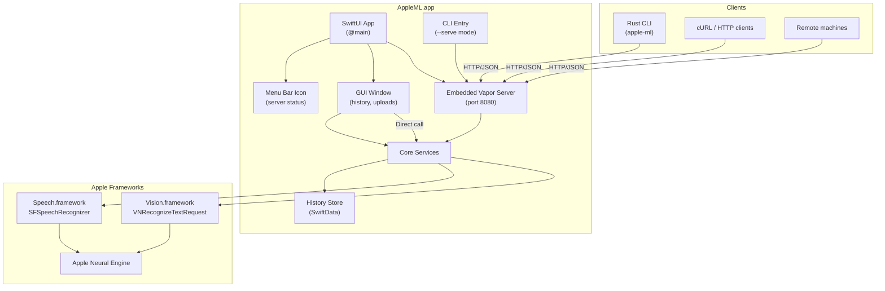

<!-- agent-updated: 2026-04-21T06:00:00Z -->

# Architecture

## Overview

AppleML is a native macOS application that provides on-device speech-to-text and OCR using Apple's ML frameworks (Speech.framework, Vision.framework) with Apple Neural Engine acceleration. It follows the Ollama model: a single app that runs as both a GUI application and a headless API server.

## Two Entry Points, One Codebase

| Launch method | Behavior |
|---|---|
| **Double-click app** / `open AppleML.app` | Menu bar icon + GUI window + API server |
| **Terminal:** `AppleML.app/Contents/MacOS/AppleML --serve` | Headless API server only (no GUI) |

Both modes share the same Core services, routes, and history storage.

## Component Diagram



## Project Structure

```
apple-ml-server/
├── AppleML/                         # Xcode project (macOS app)
│   ├── AppleML.xcodeproj
│   ├── AppleML/
│   │   ├── Info.plist               # Bundle config, privacy descriptions
│   │   ├── AppleML.entitlements     # App sandbox, network server
│   │   ├── Assets.xcassets          # App icon
│   │   ├── App/
│   │   │   ├── AppleMLApp.swift     # @main, lifecycle, permission request
│   │   │   └── MenuBarView.swift    # Menu bar icon + status dropdown
│   │   ├── Views/
│   │   │   ├── MainView.swift       # NavigationSplitView (sidebar + detail)
│   │   │   ├── NewTaskView.swift    # Feature selection cards + workspace
│   │   │   ├── HistoryDetailView.swift # History item detail view
│   │   │   ├── TranscribeView.swift # Drag-drop audio, transcription
│   │   │   ├── OCRView.swift        # Drag-drop image, OCR
│   │   │   └── SettingsView.swift   # Port, bind address, language
│   │   ├── Server/
│   │   │   ├── ServerManager.swift  # Start/stop Vapor, status tracking
│   │   │   ├── Routes.swift         # HTTP route definitions
│   │   │   └── OpenAPISpec.swift    # Embedded OpenAPI 3.0 spec
│   │   ├── Core/
│   │   │   ├── Models.swift         # Request/Response types, MLError
│   │   │   ├── TranscribeService.swift
│   │   │   ├── OCRService.swift
│   │   │   ├── SpeechWorker.swift
│   │   │   └── LanguageDetector.swift
│   │   └── Storage/
│   │       ├── HistoryStore.swift   # SwiftData model + queries
│   │       └── HistoryItem.swift    # @Model: timestamp, input, result
│   ├── project.yml                  # XcodeGen spec
├── cli/                             # Rust CLI client (unchanged)
│   ├── Cargo.toml
│   └── src/main.rs
├── sdk/                             # Rust SDK library (unchanged)
│   ├── Cargo.toml
│   └── src/
├── docs/                            # Documentation
└── README.md
```

## Data Flow

### API Request (Remote or CLI)

```
Client ─── HTTP POST /transcribe ───► Vapor Server ─► TranscribeService ─► Speech.framework
                                           │                                      │
                                           ▼                                      ▼
                                      HistoryStore ◄──── result ◄──────── ANE transcription
                                           │
                                           ▼
                                      JSON response ───► Client
```

### GUI Upload (Local)

```
User drops file ───► TranscribeView ─► TranscribeService ─► Speech.framework
                           │                                       │
                           ▼                                       ▼
                      HistoryStore ◄──── result ◄──────── ANE transcription
                           │
                           ▼
                      HistoryView (updates live)
```

## Threading Model

- **Vapor server** runs on its own EventLoopGroup (NIO threads)
- **SpeechWorker** spawns a dedicated `Thread` per recognition with its own `RunLoop` (required by Speech.framework callbacks)
- **GUI** runs on `@MainActor` (standard SwiftUI)
- **History writes** use SwiftData's `ModelContext` on the appropriate actor

## API Endpoints

| Method | Path | Description |
|--------|------|-------------|
| GET | `/health` | Health check |
| GET | `/version` | Server version |
| GET | `/openapi.yaml` | OpenAPI 3.0 spec |
| POST | `/transcribe` | Speech-to-text (auto-detects language if omitted) |
| POST | `/ocr` | Image OCR |

API is fully backward-compatible with the previous CLI server.

## History Storage

SwiftData with a single `HistoryItem` model:

| Field | Type | Description |
|-------|------|-------------|
| `id` | UUID | Primary key |
| `timestamp` | Date | When the request was processed |
| `type` | enum | `.transcribe` or `.ocr` |
| `inputFileName` | String? | Original file name (if known) |
| `language` | String | Detected or specified language |
| `result` | String | Transcript text or OCR text |
| `confidence` | Float | Overall confidence |
| `processingTimeMs` | Int64 | Processing duration |

History is stored locally in the app's container. Both GUI and API requests write to the same store.

## Permissions

As a proper `.app` bundle, macOS handles permissions natively:

- **Speech Recognition**: Prompted automatically on first use. No manual TCC hacks needed.
- **Network (Incoming)**: App declares `com.apple.security.network.server` entitlement to accept incoming connections.
- **OCR**: No special permissions required.

## Error Handling

| Error | HTTP Status | Description |
|-------|-------------|-------------|
| `invalidInput(msg)` | 400 | Malformed base64, unsupported format |
| `notAuthorized` | 403 | Speech recognition permission denied |
| `languageNotSupported` | 400 | Language not available |
| `recognitionFailed(msg)` | 500 | Speech/Vision processing error |

## Deployment

| Method | Description |
|--------|-------------|
| **Development** | `open AppleML.app` or run from Xcode |
| **Headless** | `./AppleML.app/Contents/MacOS/AppleML --serve` |
| **Distribution** | DMG, Homebrew cask, or direct `.app` copy to /Applications |
| **Launch at Login** | Toggle in app settings (uses `SMAppService`) |
