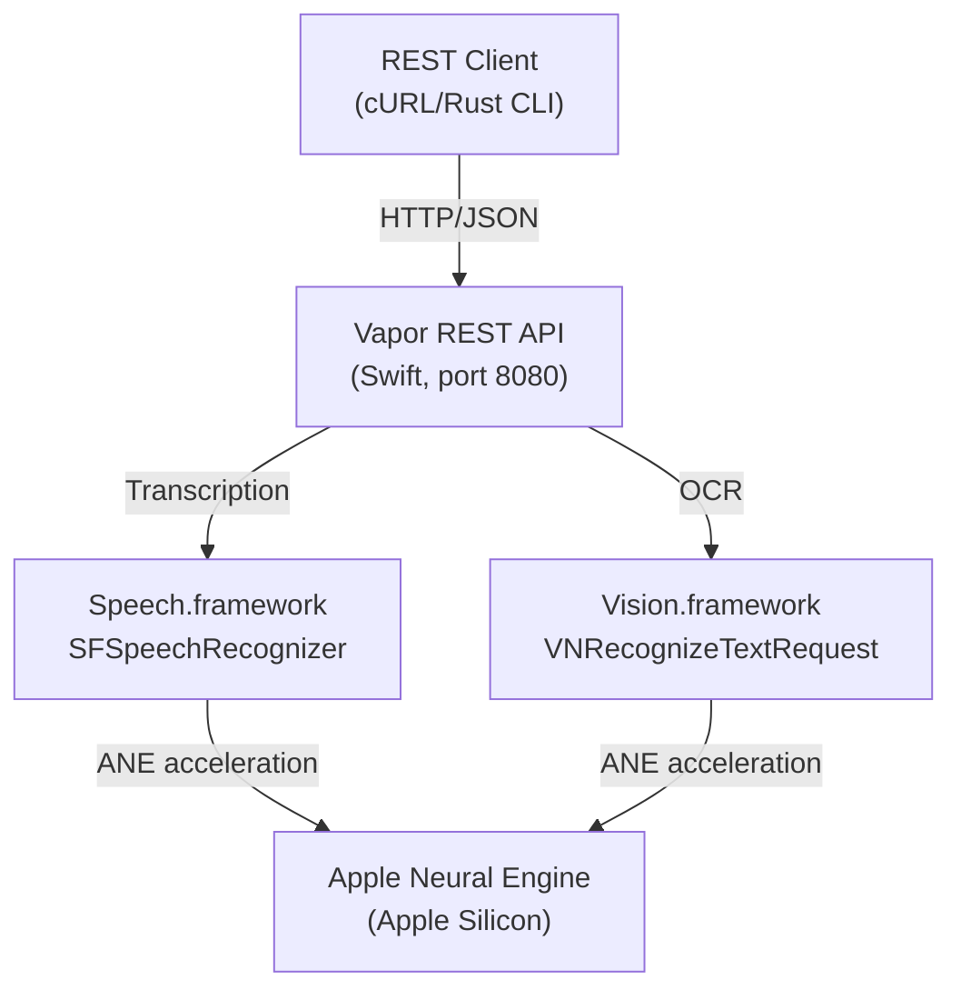

# Architecture

<!-- agent-updated: 2026-04-20T15:20:00Z -->

## Overview

apple-ml-server is a pure Swift REST API server using Vapor. It provides on-device speech-to-text and OCR using Apple's native ML frameworks (Speech.framework, Vision.framework) with Apple Neural Engine acceleration. No cloud dependencies.

## Component Diagram



## API Endpoints

| Method | Path | Description |
|--------|------|-------------|
| GET | `/health` | Health check |
| GET | `/version` | Server version |
| GET | `/openapi.yaml` | OpenAPI 3.0 spec |
| POST | `/transcribe` | Speech-to-text |
| POST | `/ocr` | Image OCR |

## Data Flow

### Transcribe

```
Client ──── POST /transcribe ────▶ Vapor ────▶ Speech.framework ────▶ ANE
              {audio: base64}                    transcript text ◀──────┘
```

1. Client sends JSON with base64-encoded audio
2. Server decodes and writes to temp file
3. `SpeechWorker` spawns dedicated thread with its own RunLoop
4. `SFSpeechRecognizer` performs on-device transcription
5. Response returned as JSON with transcript, confidence, timing

### OCR

```
Client ──── POST /ocr ────▶ Vapor ────▶ Vision.framework ────▶ ANE
              {image: base64}                  text + bboxes ◀──────┘
```

1. Client sends JSON with base64-encoded image
2. Server decodes to `NSImage` → `CGImage`
3. `VNRecognizeTextRequest` performs OCR
4. Response returned as JSON with text blocks and bounding boxes

## Project Structure

```
apple-ml-server/
├── server/                      # Swift Vapor REST API server
│   ├── Package.swift
│   └── Sources/
│       ├── main.swift          # Entry point, routes, OpenAPI spec
│       ├── Models.swift         # Request/Response types, MLError
│       ├── TranscribeService.swift  # Transcription logic
│       ├── OCRService.swift    # OCR logic
│       └── SpeechWorker.swift  # Dedicated thread per recognition
├── cli/                        # Rust CLI client
│   ├── Cargo.toml
│   └── src/main.rs
├── openapi.yaml               # OpenAPI 3.0 specification
├── Makefile                   # Build/run commands
└── docs/                      # Documentation
```

## Threading Model

`SpeechWorker` uses a dedicated `Thread` per recognition request, each with its own `RunLoop`. This is required because `SFSpeechRecognizer.recognitionTask` callbacks fire on the thread's run loop, not async/await context.

## Error Handling

All errors implement `MLError` and map to HTTP status codes:

| Error | HTTP Status | Description |
|-------|-------------|-------------|
| `invalidInput(msg)` | 400 | Malformed base64, unsupported format |
| `notAuthorized` | 403 | Speech recognition not permitted |
| `languageNotSupported` | 400 | Language not available |
| `recognitionFailed(msg)` | 500 | Speech/Vision processing error |

## Privacy & Permissions

Speech recognition requires user authorization on macOS:

1. First call triggers `SFSpeechRecognizer.requestAuthorization`
2. System shows permission dialog (must be user-initiated, not background)
3. Subsequent calls use cached authorization status

OCR (Vision.framework) does not require special permissions for `VNRecognizeTextRequest`.
